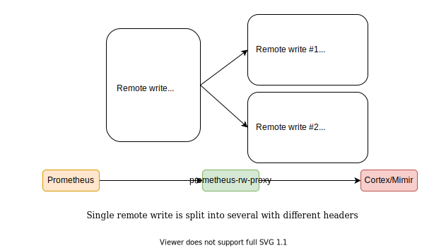

# prometheus-rw-proxy

Prometheus remote write proxy which marks timeseries with a Cortex/Mimir tenant ID based on labels.

## Architecture



## Overview

Cortex/Mimir tenants (separate namespaces where metrics are stored to and queried from) are identified by `X-Scope-OrgID` HTTP header on both writes and queries.

~~Problem is that Prometheus can't be configured to send this header~~ Actually in some recent version (year 2021 onwards) this functionality was added, but the tenant is the same for all jobs. This makes it impossible to use a single Prometheus (or an HA pair) to write to multiple tenants.

This software solves the problem using the following logic:

- Receive Prometheus remote write
- Search each timeseries for a specific label name and extract a tenant ID from its value.
  If the label wasn't found then it can fall back to a configurable default ID.
  If none is configured then the write request will be rejected with HTTP code 400
- Optionally removes this label from the timeseries
- Groups timeseries by tenant
- Issues a number of parallel per-tenant HTTP requests to Cortex/Mimir with the relevant tenant HTTP header (`X-Scope-OrgID` by default)

## Usage

### HTTP Endpoints

- GET `/-/ready` returns 200 by default and 503 if the service is shutting down (if `timeout_shutdown` setting is > 0)
- POST `/api/v1/write` receives metrics from Prometheus - configure remote write to send here

### Configuration

The service can be configured by a config file and/or environment variables. Config file may be specified by passing `-config` CLI argument.

If both are used then the env vars have precedence (i.e. they override values from config).
See below for config file format and corresponding env vars.

```yaml
# Where to listen for incoming write requests from Prometheus
# env: PRWPROXY_LISTEN
listen: 0.0.0.0:8080

# listen path for incoming write requests from Prometheus
# env: PRWPROXY_LISTEN_PATH
listen_path: /api/v1/write

# Profiling API, remove to disable
# env: PRWPROXY_LISTEN_PPROF
listen_pprof: 0.0.0.0:7008

# enable tls setting
tls_cert_file: ""
tls_key_file: ""

# Where to send the modified requests (Cortex/Mimir)
# env: PRWPROXY_TARGET
target: http://127.0.0.1:9091/receive

# Whether to enable querying for IPv6 records
# env: PRWPROXY_ENABLE_IPV6
enable_ipv6: false

# Whether to enable HTTP2 
# env: PRWPROXY_ENABLE_HTTP2
enable_http2: true

# This parameter sets the limit for the count of outgoing concurrent connections to Cortex / Mimir.
# By default it's 64 and if all of these connections are busy you will get errors when pushing from Prometheus.
# If your `target` is a DNS name that resolves to several IPs then this will be a per-IP limit.
# env: PRWPROXY_MAX_CONNS_PER_HOST
max_conns_per_host: 0

# Authentication (optional)
auth:
  # Egress HTTP basic auth -> add `Authentication` header to outgoing requests
  egress:
    # env: PRWPROXY_AUTH_EGRESS_USERNAME
    username: foo
    # env: PRWPROXY_AUTH_EGRESS_PASSWORD
    password: bar

# Log level
# env: PRWPROXY_LOG_LEVEL
log_level: warn

# HTTP request timeout
# env: PRWPROXY_TIMEOUT
timeout: 10s

# HTTP request idle timeout
# env: PRWPROXY_IDLE_TIMEOUT
idle_timeout: 60s

# Timeout to wait on shutdown to allow load balancers detect that we're going away.
# During this period after the shutdown command the /alive endpoint will reply with HTTP 503.
# Set to 0s to disable.
# env: PRWPROXY_TIMEOUT_SHUTDOWN
timeout_shutdown: 10s

# Max number of parallel incoming HTTP requests to handle
# env: PRWPROXY_CONCURRENCY
concurrency: 10

# Whether to forward metrics metadata from Prometheus to Cortex/Mimir
# Since metadata requests have no timeseries in them - we cannot divide them into tenants
# So the metadata requests will be sent to the default tenant only, if one is not defined - they will be dropped
# env: PRWPROXY_METADATA
metadata: false

# If true response codes from metrics backend will be logged to stdout. This setting can be used to suppress errors
# which can be quite verbose like 400 code - out-of-order samples or 429 on hitting ingestion limits
# Also, those are already reported by other services like Cortex/Mimir distributors and ingesters
# env: PRWPROXY_LOG_RESPONSE_ERRORS
log_response_errors: true

# Maximum duration to keep outgoing connections alive (to Cortex/Mimir)
# Useful for resetting L4 load-balancer state
# Use 0 to keep them indefinitely
# env: PRWPROXY_MAX_CONN_DURATION
max_connection_duration: 0s

# Address where metrics are available
# env: PRWPROXY_LISTEN_METRICS_ADDRESS
listen_metrics_address: 0.0.0.0:9090

# If true, then a label with the tenant’s name will be added to the metrics
# env: PRWPROXY_METRICS_INCLUDE_TENANT
metrics_include_tenant: true

tenant:
  # Which label to look for the tenant information
  # env: PRWPROXY_TENANT_LABEL
  label: tenant

  # List of labels examined for tenant information. If set takes precedent over `label`
  # env: PRWPROXY_TENANT_LABEL_LIST
  label_list:
    - tenant
    - other_tenant

  # Whether to remove the tenant label from the request
  # env: PRWPROXY_TENANT_LABEL_REMOVE
  label_remove: true
  
  # To which header to add the tenant ID
  # env: PRWPROXY_TENANT_HEADER
  header: X-Scope-OrgID

  # Which tenant ID to use if the label is missing in any of the timeseries
  # If this is not set or empty then the write request with missing tenant label
  # will be rejected with HTTP code 400
  # env: PRWPROXY_TENANT_DEFAULT
  default: foobar

  # Enable if you want all metrics from Prometheus to be accepted with a 204 HTTP code
  # regardless of the response from upstream. This can lose metrics if Cortex/Mimir is
  # throwing rejections.
  # env: PRWPROXY_TENANT_ACCEPT_ALL
  accept_all: false

  # Optional prefix to be added to a tenant header before sending it to Cortex/Mimir.
  # Make sure to use only allowed characters:
  # https://grafana.com/docs/mimir/latest/configure/about-tenant-ids/
  # env: PRWPROXY_TENANT_PREFIX
  prefix: foobar-

  # If true will use the tenant ID of the inbound request as the prefix of the new tenant id.
  # Will be automatically suffixed with a `-` character.
  # Example:
  #   Prometheus forwards metrics with `X-Scope-OrgID: Prom-A` set in the inbound request.
  #   This would result in the tenant prefix being set to `Prom-A-`.
  # https://grafana.com/docs/mimir/latest/configure/about-tenant-ids/
  # env: PRWPROXY_TENANT_PREFIX_PREFER_SOURCE
  prefix_prefer_source: false

  # apply a regex to match a tenant label value. The tenant id will be the key of label_value_matcher. Order matters.
  label_value_matcher:
    - name: tenant-group1
      regex: tenant1|tenant2
    - name: tenant-group2
      regex: tenant3|tenant4
```

### Prometheus configuration example

```yaml
remote_write:
  - name: prometheus-rw-proxy
    url: http://127.0.0.1:8080/api/v1/write

scrape_configs:
  - job_name: job1
    scrape_interval: 60s
    static_configs:
      - targets:
          - target1:9090
        labels:
          tenant: foobar

  - job_name: job2
    scrape_interval: 60s
    static_configs:
      - targets:
          - target2:9090
        labels:
          tenant: deadbeef
```

This would result in `job1` metrics ending up in the `foobar` tenant in Cortex/Mimir and `job2` in `deadbeef`.

